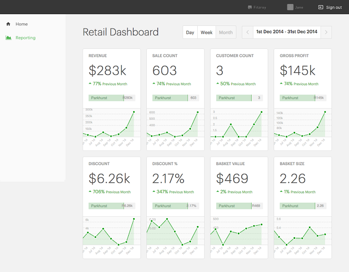

#blueq-interview-task

The interview task for BlueQ. The task is to create a functional webpage that
looks like:

Currently the webpage looks very similar to the target image.

Features:

 - Mobile compatible
 - Panels are dynamically generated using the Panels.createPanel(...) method.
